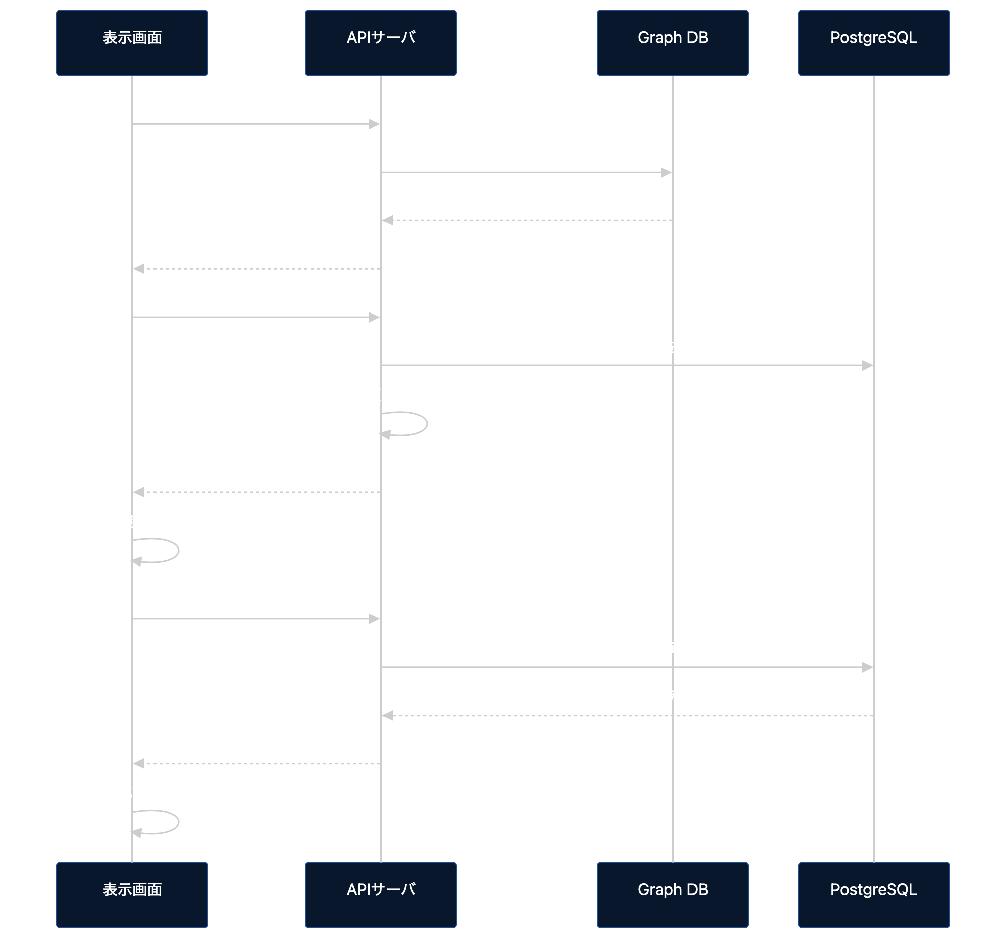

# データ収集・メタデータ管理 プロトタイプ

PostgreSQL、TinkerPop/Gremlin Server、FastAPI、3つの表示アプリをDocker Composeで起動するプロトタイプです。

## 構成

- PostgreSQL 16：AI/AO/DI/DO時系列データと有効区間
- TinkerPop 3.8.1：Plant、Signal、Table、Database、Applicationと関係
- FastAPI：表示可能範囲、時系列データ、メタデータAPI
- 表示アプリ1～3：それぞれ異なる10信号の共通有効期間とトレンド

## 起動

```bash
cp .env.example .env
docker compose up --build
```

起動後：

- 表示アプリ1：<http://localhost:8000/apps/display-app-1>
- 表示アプリ2：<http://localhost:8000/apps/display-app-2>
- 表示アプリ3：<http://localhost:8000/apps/display-app-3>
- OpenAPI UI：<http://localhost:8000/docs>
- Gremlin Server：`ws://localhost:8182/gremlin`
- PostgreSQL：`localhost:5432`

## 起動シーケンス


## 初期データ

| 種別 | 信号数 | 保存率 | テーブル |
|---|---:|---:|---|
| AI | 50 | 50% | `ai_mhr` |
| AO | 10 | 30% | `ao_mhr` |
| DI | 30 | 20% | `di_mhr` |
| DO | 10 | 20% | `do_mhr` |

対象期間は実行年の2年前1月1日00:00 UTCから前年12月31日23:59 UTCまでです。各信号の保存区間は決定的な乱数で配置され、各連続区間は最低1週間です。

既定の`SEED_PROFILE=demo`は1時間周期です。短時間で試すための構成で、約63万行を生成します。要件どおり1分周期にする場合は`.env`を次のように変更します。

```dotenv
SEED_PROFILE=full
```

`full`は約3,800万行を生成するため、初回起動に時間とディスク容量を要します。profileを変更した後、完全に作り直す場合は開発用データを削除して再起動します。

```bash
docker compose down -v
docker compose up --build
```

## テスト

Dockerを使わないコアロジックのテスト：

```bash
cd api
PYTHONPATH=. python -m unittest discover ../tests -v
```

起動後の確認：

```bash
curl http://localhost:8000/api/v1/health
curl http://localhost:8000/api/v1/signals
curl http://localhost:8000/api/v1/applications/display-app-1/signals
```

## 設計上の注意

- Graph DBは意味と関係、PostgreSQLは大量の値と区間を保持します。
- 3表示アプリは同じ静的フロントエンドを再利用しますが、Graph DBの異なる`Application-[:USES]->Signal`関係で独立した論理アプリとして動作します。
- 各アプリの10信号には同じ乱数系列で区間を配置し、少なくとも共通表示可能範囲が得られるようにしています。アプリに使わない残り70信号は信号ごとに独立した乱数配置です。
- プロトタイプ起動時はGraph DBを100信号・3アプリの初期状態へ再構築します。
- 認証、Collector、バックグラウンド収集ジョブは仕様化済みですが、この初期プロトタイプでは未実装です。
