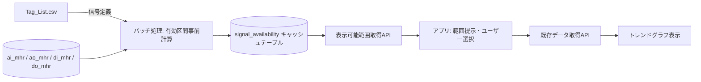

# 「表示可能範囲取得API」問題整理・仕様書

## 1. 背景・現状の課題

現場の時系列データ（AI/AO/DI/DO）はテーブルごとに保存されているが、以下の理由でトレンドグラフ表示時にエラーや失敗が頻発している。

- 現場ごと・期間ごとにデータの保存範囲がバラバラ（メンテナンスによる長期欠測期間が存在）
- テーブルの最初〜最後の日付の中に「結測（データが記録されていない/抜けている）」期間が含まれる
- 従来方式は「テーブルの先頭日付〜末尾日付」だけを見ており、結測の有無をチェックしていないため、指定した範囲にデータが実在するとは限らない
- 複数信号を1つのグラフに重ねて表示する要件があるため、全信号がそろって連続的に存在する範囲を事前に把握できないと、都度失敗する

## 2. 目的

アプリが検索範囲を指定する前に、**「今、指定Tagリストの信号すべてを結測なく重ねて表示できる期間はどこか」**をあらかじめ返すAPIを新設する。これにより、

- ユーザー/アプリ側が「存在しない範囲」を指定してしまう失敗を防ぐ
- グラフ側では結測を含まないデータのみを扱えることを保証する

## 3. 用語定義

| 用語 | 定義 |
|---|---|
| 結測 | 本来1分間隔で記録されるはずのデータにおいて、1点でも欠けている状態（本仕様では厳密判定を採用） |
| 有効区間（valid segment） | ある1つの信号について、結測を含まず連続してデータが存在する期間 |
| 共通有効範囲 | 指定された複数信号すべての有効区間の積集合（intersection）。全信号が同時にそろって結測なく存在する期間 |

> **確認事項への回答（ユーザー確定分）**
> - 有効範囲は「信号ごと」ではなく「複数信号をまとめた共通範囲」として返す
> - 結測判定は1点でも欠けていれば結測（厳密判定）
> - 有効期間は事前計算し、キャッシュ用テーブルに保持する方式とする
> - グラフ上での欠測期間の見せ方（詰めて表示 or 空白で途切れさせる）はアプリ側の別問題とし、本APIのスコープ外とする

## 4. データ前提

- 信号種別ごとに異なるテーブルに格納：`ai_mhr`（アナログ入力）, `ao_mhr`（アナログ出力）, `di_mhr`（デジタル入力）, `do_mhr`（デジタル出力）
- 各テーブルのスキーマ：`date_time`, `data_id`, `value`
- 表示対象の信号リストは `Tag_List.csv` にあらかじめ定義されている（アプリと同一フォルダに配置）
  - **CSVには信号ID（data_id）のみが含まれ、信号種別（AI/AO/DI/DO）の情報は含まれない**
  - `data_id` は4テーブル（ai_mhr/ao_mhr/di_mhr/do_mhr）をまたいで一意であり、1つの `data_id` は必ずいずれか1テーブルにしか存在しない（ユーザー確認済み）
  - `data_id` → テーブル名の対応関係を示す別のマスタ情報源は存在しない。そのため、**4テーブルを実際に検索して「当たり」を付ける**ことでテーブルを解決する必要がある（詳細は6.1節・7.1節）
- データ収集は基本1分間隔だが、期間によって収集自体が行われていない（長期メンテナンス等）区間がある

## 5. 全体アーキテクチャ



- 従来の「都度クエリして結測チェック」をやめ、**信号ごとの有効区間を事前計算してキャッシュテーブルに保持**しておく
- API呼び出し時はキャッシュテーブルを読み、指定信号群の積集合を計算するだけにする（重いテーブルスキャンをリクエスト都度行わない）

## 6. キャッシュテーブル設計

### 6.1 `tag_table_map`（信号ID→テーブル対応表）

`Tag_List.csv` に種別情報がないため、`data_id` がどのテーブルに属するかを解決した結果をキャッシュしておく専用テーブル。一度解決できれば、`data_id` が変わらない限り再解決は不要（一意性が保証されているため）。

| カラム | 型 | 説明 |
|---|---|---|
| data_id | varchar (PK) | 信号ID |
| table_name | varchar | 解決されたテーブル名（ai_mhr / ao_mhr / di_mhr / do_mhr） |
| resolved_at | datetime | 解決（4テーブル探索）を行った日時 |
| status | varchar | `found` / `not_found`（どのテーブルにも存在しなかった場合） |

- `signal_availability` の事前計算バッチは、まずこの `tag_table_map` を参照し、未解決の `data_id` があれば解決処理（7.1節）を先に実行してからテーブルを確定させる
- `status = not_found` の信号は、Tag_List.csvの記載ミスやテーブルへのデータ投入待ちの可能性があるため、`warnings` としてAPIレスポンスに含める（8.3節）

### 6.2 `signal_availability`（信号ごとの有効区間）

| カラム | 型 | 説明 |
|---|---|---|
| id | bigint (PK) | 連番 |
| data_id | varchar | 信号ID |
| table_name | varchar | ai_mhr / ao_mhr / di_mhr / do_mhr |
| start_time | datetime | 有効区間の開始（結測なく連続してデータがある区間の先頭） |
| end_time | datetime | 有効区間の終了 |
| point_count | int | 区間内のデータ点数（検証・監視用、任意） |
| updated_at | datetime | このレコードが計算・更新された日時 |

- 1つの信号について、結測なく連続するデータ区間ごとに1レコード（複数レコードになり得る）
- 例：ある信号が「1〜3月は連続」「11〜12月は連続」であれば2レコード

### 6.3 `signal_availability_batch_log`（バッチ実行管理用、任意）

| カラム | 型 | 説明 |
|---|---|---|
| data_id | varchar | 信号ID |
| table_name | varchar | テーブル名 |
| last_processed_time | datetime | この信号について、どこまでの時刻を計算済みか |
| last_run_at | datetime | 最終バッチ実行日時 |

- 差分計算（増分更新）を可能にするための管理テーブル。新規データが追記された分だけ再計算すればよく、毎回全期間をフルスキャンしなくて済む

## 7. 有効区間の事前計算バッチ

### 7.1 処理概要（信号1つあたり）

0. **テーブル解決（初回のみ）**：`tag_table_map` に対象 `data_id` が未登録の場合、以下の手順でテーブルを特定する
   - `ai_mhr` → `ao_mhr` → `di_mhr` → `do_mhr` の順（または並列）に、`SELECT 1 FROM <table> WHERE data_id = ? LIMIT 1` のような存在確認クエリを実行
   - `data_id` は一意である前提のため、最初にヒットしたテーブルを正として `tag_table_map` に登録し、以降の探索は打ち切る
   - どのテーブルにもヒットしない場合は `status = not_found` として記録し、以降のバッチでは（Tag_List.csvから削除されない限り）再解決を試みる
   - **前提**：この存在確認クエリを高速に行うため、各テーブルの `data_id` カラムにインデックスが張られていることが必須（インデックスが無い場合、4テーブル全件スキャンが発生し非常に重くなる。8.5節参照）
1. `tag_table_map` から対象 `data_id` の `table_name` を取得
2. 対象テーブルから該当 `data_id` のレコードを `date_time` 昇順に取得（差分実行時は `last_processed_time` 以降のみ）
3. 連続する2点の `date_time` の差分をチェック
   - 差分が想定間隔（1分）と一致する → 同一有効区間として継続
   - 差分が1分を超える → そこで有効区間を区切り、新しい区間として開始
4. 確定した有効区間を `signal_availability` にUPSERT
5. `signal_availability_batch_log` を更新

### 7.2 実行タイミング（要検討事項）

以下のいずれか、または組み合わせを想定。運用要件に応じて決定：

- 定期バッチ（例：日次夜間）で全信号を差分更新
- `Tag_List.csv` が更新された（信号追加・削除）タイミングで、追加された信号のみ初回フル計算
- 元データ取り込みバッチと連動し、新規データ投入直後に対象信号のみ即時再計算

> **リスクと留意点**：「1点でも欠けたら結測」という厳密な定義のため、センサーの瞬断等が多い信号では有効区間が非常に細かく分裂し、`signal_availability` のレコード数が膨大になる可能性がある。運用開始後にレコード数・パフォーマンスを監視し、必要であれば「数分程度の欠損は許容する」といった緩和ルールの導入を再検討することを推奨する（第10章参照）。

## 8. API仕様

### 8.1 エンドポイント

```
POST /api/v1/available-range
```

### 8.2 リクエスト

```json
{
  "signal_ids": ["TIC101.PV", "FIC202.PV", "PV_MODE_01"]
}
```

| フィールド | 型 | 必須 | 説明 |
|---|---|---|---|
| signal_ids | string[] | ○ | 対象信号IDのリスト（Tag_List.csvに定義された信号のサブセット） |

※ 検索期間の指定は不要（このAPIの目的は「そもそも表示可能な範囲はどこか」を返すことのため）。将来的に「特定期間内に絞って有効範囲を知りたい」ニーズが出た場合は、任意パラメータ `range_hint_start` / `range_hint_end` を追加拡張可能。

### 8.3 レスポンス

```json
{
  "common_valid_periods": [
    { "start_time": "2025-01-01T00:00:00", "end_time": "2025-03-31T23:59:00" },
    { "start_time": "2025-11-01T00:00:00", "end_time": "2025-12-31T23:59:00" }
  ],
  "signals": [
    {
      "signal_id": "TIC101.PV",
      "table_name": "ai_mhr",
      "status": "ok"
    },
    {
      "signal_id": "PV_MODE_01",
      "table_name": "do_mhr",
      "status": "ok"
    }
  ],
  "warnings": []
}
```

| フィールド | 説明 |
|---|---|
| common_valid_periods | 指定した全信号が結測なくそろって存在する連続期間のリスト（複数になり得る） |
| signals | 各信号のテーブル解決結果や個別ステータス（診断用） |
| warnings | 例：Tag_List.csvに存在しない信号IDが指定された、キャッシュが未計算、等 |

`signals[].status` の想定値：

| status | 意味 |
|---|---|
| ok | `tag_table_map` でテーブル解決済み、`signal_availability` も計算済み |
| table_not_found | 4テーブルいずれにも `data_id` が存在せず、テーブル解決に失敗（`tag_table_map.status = not_found`） |
| availability_not_computed | テーブルは解決済みだが、まだ `signal_availability` の事前計算バッチが実行されていない |

- `signal_ids` に `table_not_found` や `availability_not_computed` の信号が含まれる場合、その信号は共通範囲の積集合計算から除外した上で `warnings` に理由を明記する（除外せずエラーとするかは運用方針次第）
- `common_valid_periods` が空配列の場合は「指定信号すべてに共通する結測なし期間が存在しない」ことを意味する

### 8.4 計算ロジック（共通有効範囲の積集合）

1. `signal_ids` それぞれについて `signal_availability` から有効区間リストを取得
2. 全信号の区間リストをスイープライン法（区間の開始点・終了点でソートして走査）で積集合演算
   - 各時点で「その時点を含む有効区間を持つ信号数」をカウントし、対象信号数と一致する区間のみを共通有効期間として採用
3. 結果の連続区間リストを `common_valid_periods` として返す

信号数が少ない場合は単純な区間交差アルゴリズムでも十分高速に計算可能（キャッシュテーブル参照のみで完結するため、元データテーブルへのアクセスは発生しない）。

### 8.5 テーブル解決処理の性能前提

`tag_table_map` によりテーブル解決結果はキャッシュされるため、**本APIの応答時にはテーブル探索（7.1節ステップ0）は発生しない**（あくまで事前バッチ内で1回だけ行われる処理）。ただし、以下は運用上の前提として確認・整備が必要：

- 各テーブル（`ai_mhr`/`ao_mhr`/`di_mhr`/`do_mhr`）の `data_id` カラムにインデックスが存在すること（存在確認クエリ・データ取得クエリの両方で必須）
- `Tag_List.csv` に新しい `data_id` が追加された場合、次回バッチ実行時に自動的に `tag_table_map` への解決が行われる（8.1〜8.3節のとおり `status` で状態が分かるため、解決が完了するまでは `availability_not_computed` 等としてアプリ側に伝わる）

## 9. 想定される利用フロー（アプリ側）

1. アプリ起動時 or Tagグループ選択時に `POST /api/v1/available-range` を呼び、選択可能な期間候補（`common_valid_periods`）を取得
2. ユーザーに候補期間を提示（例：カレンダーUI上でグレーアウト/選択可能表示を出し分け）
3. ユーザーが範囲を選択したら、既存のデータ取得APIで実データを取得しグラフ表示
   - この時点で「結測なし」が保証されているため、従来問題だった表示失敗が起きない

## 10. 今後の検討事項

- 「1点でも欠けたら結測」の厳密判定により有効区間が過度に細分化される場合の緩和策（許容欠損の閾値導入）の要否
- `signal_availability` のレコード数が増大した場合のインデックス設計・パーティショニング方針
- `Tag_List.csv` 更新（信号の追加・削除・名称変更）を検知して自動的にバッチへ反映する仕組み
- 元データが後から過去分に遡って追記/修正された場合の再計算トリガー設計
- グラフ表示側での欠測期間の見せ方（本仕様のスコープ外だが、UI検討時に別途整理が必要）
- `data_id` の一意性は現状の運用前提として確認済みだが、将来的に命名規則の変更等で複数テーブルに同一IDが存在するケースが発生した場合、`tag_table_map` の解決ロジック（最初にヒットしたテーブルを正とする）が誤判定を起こすリスクがある。定期的に一意性チェック（同一 `data_id` が複数テーブルに存在しないかの検証バッチ）を行うことも検討に値する
