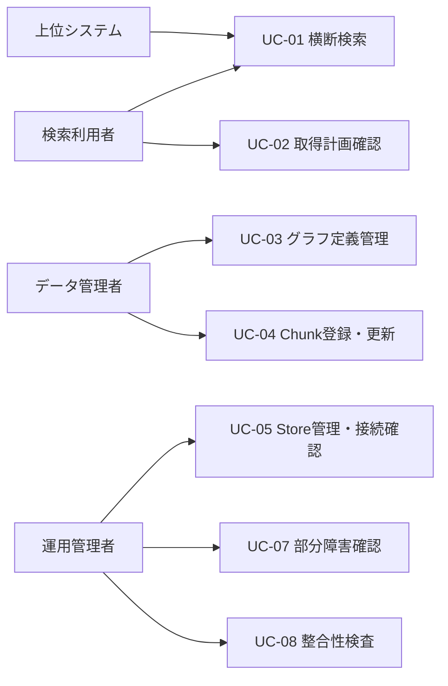
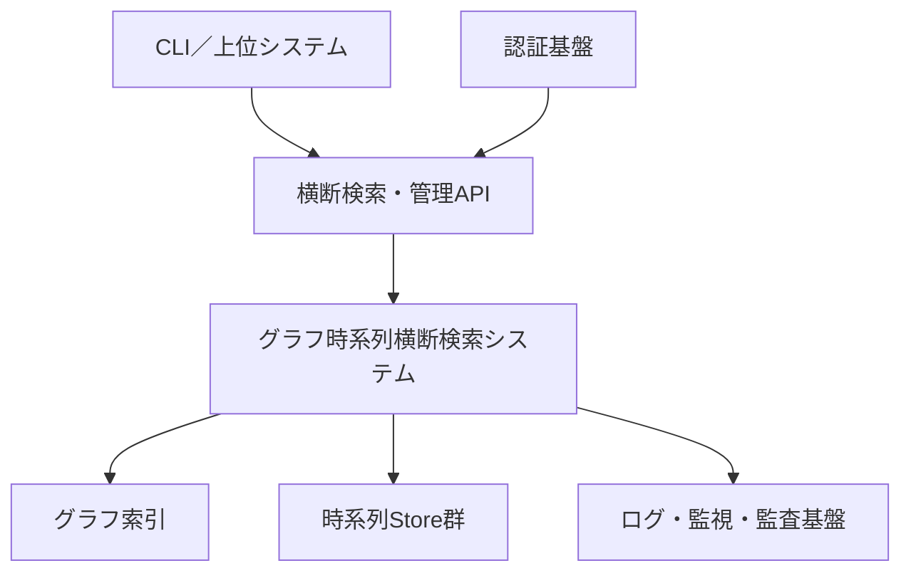
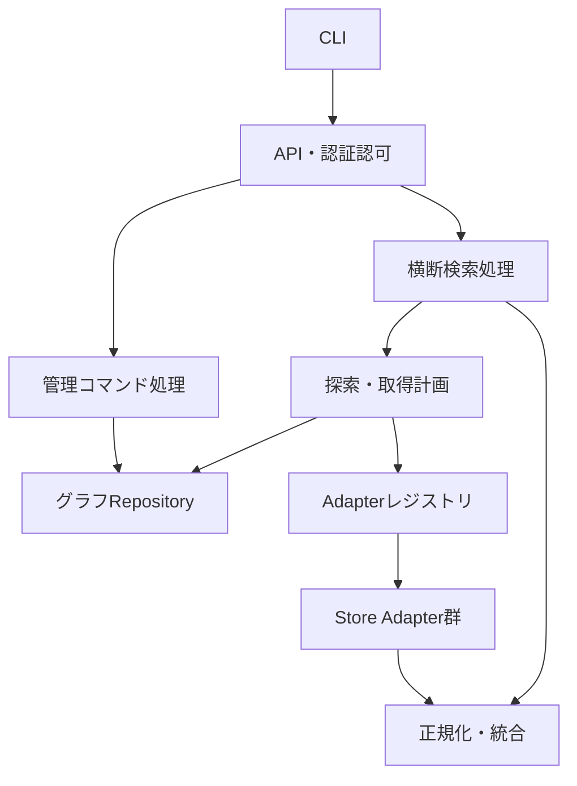
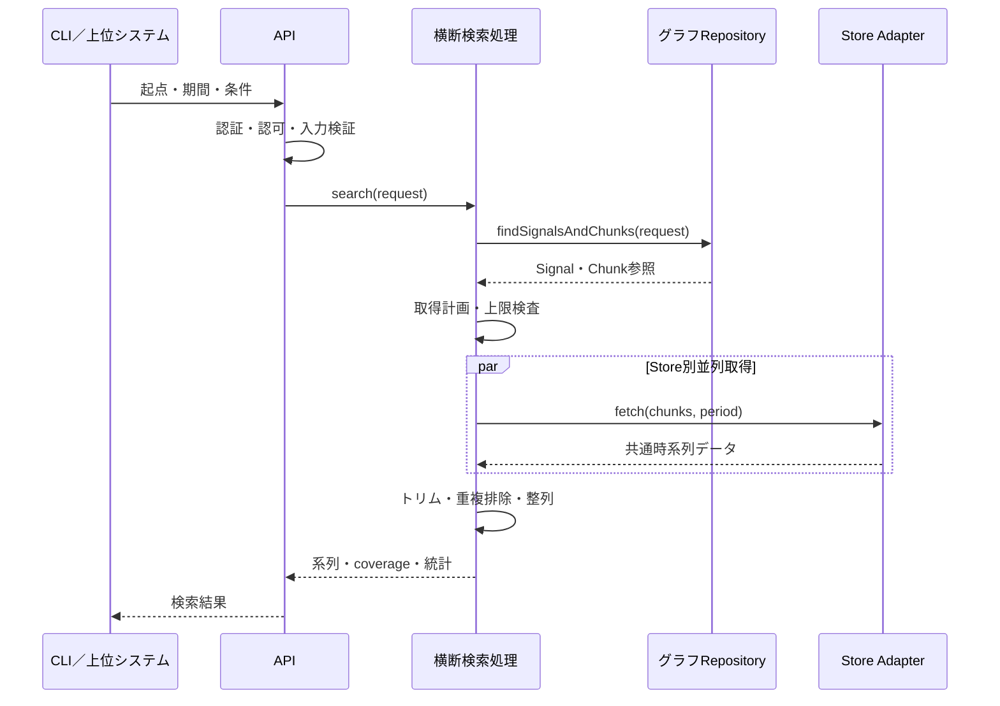
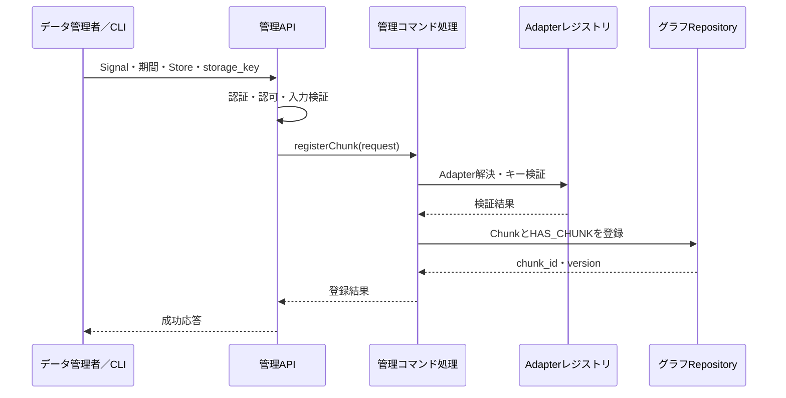
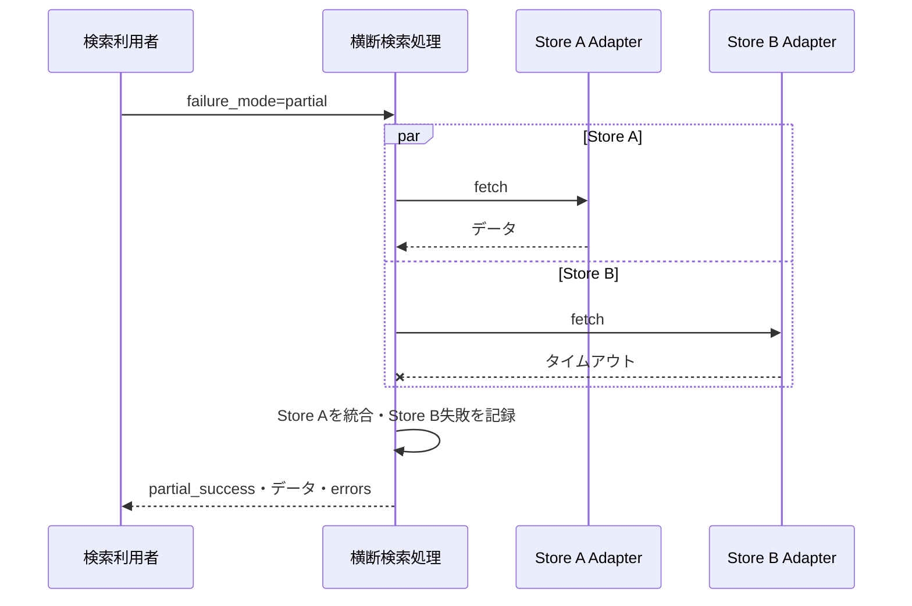
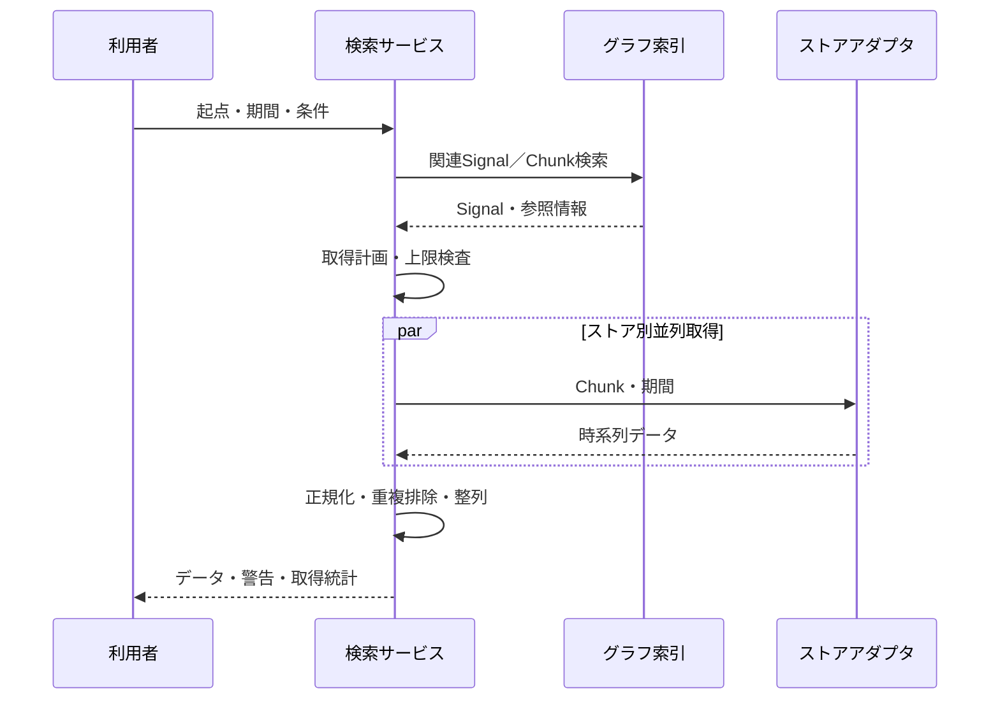

# システム仕様書：グラフ構造を用いた時系列データ横断検索システム

## 0. 文書情報

| 項目 | 内容 |
|---|---|
| 文書名 | グラフ構造を用いた時系列データ横断検索システム システム仕様書 |
| 版数 | v0.2（ユースケース・論理モジュール・シーケンス・CLI仕様追加） |
| 作成日 | 2026年9月12日 |
| 入力文書 | 要件定義書：グラフ構造を用いた時系列データ横断検索システム v0.1 |
| ステータス | ドラフト（方式・性能目標は一部要承認） |

### 0.1 本書の位置づけ

本書は、要件定義書に記載された要求を、実装・詳細設計・試験へ引き渡せる粒度に具体化したシステム仕様である。グラフDBや時系列データストアの個別製品に依存しない論理仕様を基本とし、第一候補製品を用いる場合の参照構成を併記する。

### 0.2 用語

| 用語 | 定義 |
|---|---|
| エンティティ | 工場、設備、ライン、機器など、検索起点または関係性の構成要素となる対象 |
| 信号 | センサー値、状態、実績値など、時系列データの論理的な系列 |
| 時系列チャンク | ある信号について、一定期間の実データの格納場所を表す参照メタデータ |
| グラフ索引 | エンティティ間の関係と時系列チャンクの所在を保持するグラフDB |
| ストア | 時系列データの実体を保持する外部データストア |
| アダプタ | ストア固有の検索処理を共通インターフェースへ変換するコンポーネント |
| 横断検索 | グラフで関連信号を特定し、複数ストアから時系列データを取得・統合する処理 |

---

## 1. システム方針

### 1.1 目的

本システムは、設備などのエンティティを起点として関連する信号をグラフ検索し、指定期間の時系列データを複数の異種ストアから一括取得する共通検索基盤を提供する。

### 1.2 設計原則

1. グラフDBは関係性とデータ所在のみを保持し、時系列値そのものは保持しない。
2. グラフ探索と実データ取得を分離する。
3. ストア固有処理はアダプタに閉じ込める。
4. すべての時刻をUTCで正規化し、期間境界の意味を統一する。
5. 大量取得を前提に、ページング、上限値、タイムアウト、部分失敗情報を仕様として持つ。
6. 登録・更新操作はAPI経由を原則とし、データ検証と監査を可能にする。

### 1.3 対象範囲

- エンティティ、信号、関係性、ストア定義、時系列チャンクの管理
- Gremlinを用いたグラフ探索
- 指定期間と重なるチャンクの検索
- 複数ストアからのデータ取得、統合、重複排除、期間トリム
- 外部システム向け管理APIおよび横断検索API
- 検索・管理・運用操作を行うCLI
- 認証、認可、監査、監視、障害応答

### 1.4 対象外

- センサーから各時系列ストアへのデータ収集そのもの
- 各時系列ストア内のデータ品質保証
- 可視化画面、分析画面、AI最適化機能
- 既存データの移行ツール（別仕様とする）
- ストア製品固有の物理設計・容量設計（方式設計で決定する）

---

## 2. 前提・暫定決定事項

| ID | 項目 | 仕様 | 状態 |
|---|---|---|---|
| A-01 | 時刻基準 | 内部表現はUTC。APIはISO 8601形式とし、タイムゾーンまたは `Z` を必須とする | 暫定決定 |
| A-02 | 区間表現 | チャンクおよび検索期間は半開区間 `[start_time, end_time)` とする | 暫定決定 |
| A-03 | チャンク重複 | 同一信号で期間が重なるチャンクの登録を許容する | 暫定決定 |
| A-04 | 重複排除 | 同一信号内の同一タイムスタンプを重複とみなす。優先順位は `priority`、更新日時、チャンクIDの順 | 要承認 |
| A-05 | Gremlin公開範囲 | 任意Gremlin実行は管理者・開発者向け。一般利用者は定型APIを利用する | 要承認 |
| A-06 | 応答形式 | 標準は信号単位の系列。大量取得にはストリーミングまたは非同期方式を追加可能とする | 暫定決定 |
| A-07 | 削除方式 | 管理データは論理削除を標準とし、物理削除は保守操作とする | 要承認 |

---

## 3. ユースケースと論理システム構成

### 3.1 アクター

| アクター | 説明 | 主な利用手段 |
|---|---|---|
| 検索利用者 | 設備や信号に関連する時系列データを調査・分析する利用者 | CLI、横断検索API |
| データ管理者 | Entity、Signal、関係性、Chunk、Store定義を管理する担当者 | CLI、管理API |
| 運用管理者 | 接続確認、整合性確認、障害調査、監視を行う担当者 | CLI、運用API、監視基盤 |
| 上位システム | 分析、可視化、AI、帳票などから自動検索する外部システム | 横断検索API |
| 認証基盤 | 利用者・システムを認証し、ロール情報を提供する外部基盤 | OIDC/OAuth 2.0 |

### 3.2 ユースケース一覧



| ID | ユースケース | 主アクター | 概要 |
|---|---|---|---|
| UC-01 | 時系列データを横断検索する | 検索利用者、上位システム | 起点Entityと期間から関連Signalのデータを複数Store横断で取得する |
| UC-02 | 取得計画を事前確認する | 検索利用者 | 実データを取得せず、対象Signal・Chunk・Store・推定量を確認する |
| UC-03 | Entity・Signal・関係性を管理する | データ管理者 | グラフ構造とSignal定義を登録・更新・論理削除する |
| UC-04 | 時系列Chunkを管理する | データ管理者 | データ所在、期間、優先度を登録・更新・分割・統合する |
| UC-05 | Storeを登録し接続確認する | 運用管理者、データ管理者 | Store定義とAdapter対応を登録し、接続可能性を確認する |
| UC-06 | 制限付きGremlin検索を行う | Developer、Administrator | 読み取り専用Gremlinでグラフ構造やメタデータを調査する |
| UC-07 | 部分障害を確認する | 運用管理者 | 横断検索の失敗Store・Chunk・期間・原因を特定する |
| UC-08 | メタデータ整合性を検査する | 運用管理者 | 孤立ノード、不正参照、取得不能Chunk、期間不正を検出する |

### 3.3 主要ユースケース詳細

#### 3.3.1 UC-01：時系列データを横断検索する

| 項目 | 内容 |
|---|---|
| 主アクター | 検索利用者または上位システム |
| 事前条件 | 認証済みで、起点Entityへの参照権限がある。グラフ索引にSignalとChunkが登録済みである |
| トリガー | 起点Entity、検索期間、探索条件を指定して検索を実行する |
| 正常終了条件 | 指定条件に一致する時系列データ、取得範囲、統計情報が返る |
| 最低保証 | 検索結果または失敗理由とrequest_idが返り、操作が監査可能である |

基本フロー：

1. アクターは起点Entity、開始・終了時刻、必要に応じてSignal条件を入力する。
2. システムは入力値、認証、参照権限を検証する。
3. システムは関連Signalと期間重複するChunkを抽出する。
4. システムは取得量を見積もり、制限値内であることを確認する。
5. システムはStore別に実データを取得する。
6. システムは時刻正規化、期間トリム、重複排除、整列を行う。
7. システムはSignal単位の系列、coverage、警告、統計を返す。

代替・例外フロー：

- 取得量が上限を超える場合、実データへアクセスせず、条件縮小を促す。
- 一部Storeが失敗し `failure_mode=partial` の場合、取得済みデータと失敗情報を返す。
- `failure_mode=fail_fast` の場合、最初の取得失敗で全体を失敗とする。
- 対象SignalまたはChunkが0件の場合、正常な空結果を返す。

#### 3.3.2 UC-03：Entity・Signal・関係性を管理する

| 項目 | 内容 |
|---|---|
| 主アクター | データ管理者 |
| 事前条件 | 管理権限があり、対象IDが命名規則に従っている |
| トリガー | EntityまたはSignalの登録・更新、関係性の追加・削除を要求する |
| 正常終了条件 | グラフ索引が更新され、新しいversionが返る |
| 最低保証 | 入力不正や競合時に既存データを変更せず、理由を返す |

基本フロー：

1. データ管理者はCLIまたは管理APIで定義を送信する。
2. システムはスキーマ、ID、権限、参照先の存在を検証する。
3. 関係性登録の場合は自己参照、重複、循環を検査する。
4. システムは単一トランザクションで登録または更新する。
5. システムは対象ID、version、処理結果を返し、監査ログを記録する。

代替・例外フロー：

- 同じ冪等キーの再送は、前回と同じ処理結果を返す。
- versionが一致しない更新は `VERSION_CONFLICT` とする。
- 循環を作る関係性は `RELATION_CYCLE` として拒否する。

#### 3.3.3 UC-04：時系列Chunkを登録する

| 項目 | 内容 |
|---|---|
| 主アクター | データ管理者 |
| 事前条件 | 対象Signal、Store、対応Adapterが登録済みである |
| トリガー | Signal、期間、Store、storage_keyを指定してChunkを登録する |
| 正常終了条件 | Chunkと `HAS_CHUNK` が登録され、chunk_idとversionが返る |
| 最低保証 | 登録途中の不完全なChunkを公開せず、失敗理由を返す |

基本フロー：

1. システムは時刻範囲と必須属性を検証する。
2. システムはStoreとAdapterの存在、storage_keyの形式を検証する。
3. 実データ確認が同期設定の場合、Adapterを用いて所在を確認する。
4. システムはChunkと `HAS_CHUNK` を原子的に登録する。
5. システムは登録結果を返し、監査ログを記録する。

### 3.4 システムコンテキスト



### 3.5 論理モジュール構成



### 3.6 論理モジュール責務

| モジュール | 主な責務 | 依存先 |
|---|---|---|
| CLI | 引数・設定読込、API呼出し、表／JSON／CSV出力、終了コード制御 | APIクライアント |
| APIルーティング | URLと操作の対応、要求サイズ制限、API版管理 | 認証認可、各アプリケーションサービス |
| 認証認可 | トークン検証、ロール・対象範囲の認可 | 認証基盤 |
| 入力検証 | JSONスキーマ、日時、上限、ID、versionの検証 | 共通モデル |
| 管理コマンド処理 | Entity、Signal、関係、Chunk、Storeの更新ユースケース制御 | グラフRepository、Adapterレジストリ、監査 |
| 横断検索処理 | UC-01全体の制御、タイムアウト、部分失敗の集約 | 探索・取得計画、統合処理 |
| グラフ探索 | 起点からEntity・Signal・Chunkを抽出 | グラフRepository |
| 取得計画 | Store別のChunk分割、件数推定、実行順序・並列度の決定 | Adapterレジストリ |
| グラフRepository | Gremlin生成・バインド、トランザクション、論理モデル変換 | Gremlin Server／グラフDB |
| Adapterレジストリ | `store_type` に対応するAdapterの解決と能力情報の提供 | Store Adapter群 |
| Store Adapter | Store固有クエリ、取得、共通データ点への変換 | 各時系列Store |
| 正規化・統合 | UTC化、型検証、トリム、重複排除、整列、coverage算出 | 共通モデル |
| 応答生成 | API・CLI向け結果、警告、統計、ページ情報の生成 | 横断検索処理 |
| 監査・可観測性 | 監査ログ、メトリクス、トレース、相関ID管理 | 外部監視基盤 |

モジュール間の依存方向は、外部インターフェースからアプリケーション処理、ドメイン処理、Repository／Adapterの順とする。グラフDBおよびStore製品固有コードを、横断検索処理や共通モデルへ持ち込まない。

### 3.7 代表シーケンス

#### 3.7.1 横断検索（正常系）



#### 3.7.2 Chunk登録



#### 3.7.3 Store障害時の部分成功



### 3.8 参照実装構成

| 区分 | 第一候補 | 備考 |
|---|---|---|
| グラフDB | JanusGraph | Gremlin/TinkerPop準拠。バックエンドと索引方式は性能検証後に確定 |
| グラフ検索 | Gremlin Serverまたは同等の接続層 | APIサービスからのみ接続する構成を推奨 |
| 時系列ストア | PostgreSQL/TimescaleDB、MongoDB、Redis系 | 複数混在を許容 |
| APIサービス | 未決定 | アダプタ追加性、非同期I/O、運用性を評価して決定 |

---

## 4. データ仕様

### 4.1 共通規則

- IDはシステム内で一意な不変値とし、文字列としてAPIに公開する。
- `name` は表示名であり、一意性を保証しない。
- 日時はISO 8601形式で受け付け、内部ではUTCに変換する。
- すべての管理対象に `created_at`、`updated_at`、`version`、`status` を持たせる。
- 任意属性は `attributes` に保持する。ただし検索頻度が高い属性は明示プロパティとして定義する。
- シークレット、パスワード、接続文字列をグラフのノード属性へ直接格納しない。

### 4.2 ノード仕様

#### 4.2.1 Entity

設備、ライン、機器などを単一の論理型 `Entity` として扱い、`entity_type` で分類する。製品上のラベル分割は物理設計で決定する。

| 属性 | 型 | 必須 | 制約・説明 |
|---|---|---:|---|
| entity_id | string | ○ | 一意、不変 |
| entity_type | string | ○ | 例：`factory`、`line`、`equipment`、`component` |
| name | string | ○ | 1～255文字 |
| description | string | － | 説明 |
| attributes | object | － | 任意属性 |
| status | enum | ○ | `active` / `inactive` / `deleted` |
| created_at | datetime | ○ | UTC |
| updated_at | datetime | ○ | UTC |
| version | integer | ○ | 楽観ロック用、1から開始 |

#### 4.2.2 Signal

| 属性 | 型 | 必須 | 制約・説明 |
|---|---|---:|---|
| signal_id | string | ○ | 一意、不変 |
| name | string | ○ | 表示名 |
| signal_type | string | ○ | 例：`measurement`、`state`、`event` |
| value_type | enum | ○ | `number` / `integer` / `boolean` / `string` / `object` |
| unit | string | － | 単位記号。例：`degC`、`kPa` |
| sampling_hint_ms | integer | － | 代表的サンプリング周期。検索制御の参考値 |
| attributes | object | － | 任意属性 |
| status | enum | ○ | `active` / `inactive` / `deleted` |
| created_at | datetime | ○ | UTC |
| updated_at | datetime | ○ | UTC |
| version | integer | ○ | 楽観ロック用 |

#### 4.2.3 TimeSeriesChunk

| 属性 | 型 | 必須 | 制約・説明 |
|---|---|---:|---|
| chunk_id | string | ○ | 一意、不変 |
| start_time | datetime | ○ | UTC、包含境界 |
| end_time | datetime | ○ | UTC、非包含境界。`start_time < end_time` |
| store_id | string | ○ | `DataStore.store_id` を参照 |
| storage_key | string/object | ○ | アダプタが解釈する論理参照キー |
| format | string | － | 格納形式またはスキーマ識別子 |
| priority | integer | ○ | 重複時の優先度。大きい値を優先。既定値0 |
| checksum | string | － | データ整合性確認に使用可能 |
| record_count | integer | － | 参考件数。0以上 |
| status | enum | ○ | `available` / `building` / `unavailable` / `deleted` |
| created_at | datetime | ○ | UTC |
| updated_at | datetime | ○ | UTC |
| version | integer | ○ | 楽観ロック用 |

#### 4.2.4 DataStore

| 属性 | 型 | 必須 | 制約・説明 |
|---|---|---:|---|
| store_id | string | ○ | 一意、不変 |
| store_type | string | ○ | アダプタ識別子。例：`postgres-timeseries-v1` |
| name | string | ○ | 管理用名称 |
| endpoint_ref | string | ○ | 外部設定／シークレット管理上の参照名 |
| configuration | object | － | 秘密情報を含まない接続オプション |
| timeout_ms | integer | ○ | ストア単位の取得タイムアウト |
| max_concurrency | integer | ○ | ストア単位の最大同時要求数 |
| status | enum | ○ | `active` / `maintenance` / `disabled` |
| created_at | datetime | ○ | UTC |
| updated_at | datetime | ○ | UTC |
| version | integer | ○ | 楽観ロック用 |

### 4.3 エッジ仕様

| エッジ | 始点 | 終点 | 多重度 | 説明 |
|---|---|---|---|---|
| `HAS_CHILD` | Entity | Entity | 0..n | 階層・包含関係 |
| `HAS_SIGNAL` | Entity | Signal | 0..n | エンティティが持つ信号 |
| `HAS_CHUNK` | Signal | TimeSeriesChunk | 0..n | 信号とチャンクの関係 |

エッジは `edge_id`、`relationship_type`、`valid_from`、`valid_to`、`attributes`、`created_at`、`updated_at` を持てるものとする。`HAS_CHILD` による循環は登録時に検査し、原則禁止する。

### 4.4 制約

| ID | 制約 |
|---|---|
| D-01 | `entity_id`、`signal_id`、`chunk_id`、`store_id` はそれぞれ一意であること |
| D-02 | `start_time < end_time` であること |
| D-03 | `HAS_CHUNK` の始点はSignal、終点はTimeSeriesChunkであること |
| D-04 | TimeSeriesChunkの `store_id` は有効なDataStoreを参照すること |
| D-05 | `storage_key` は対象アダプタのキー検証規則を満たすこと |
| D-06 | Entity階層に循環を作らないこと |
| D-07 | 同一IDに対する更新は `version` 一致時のみ成功すること |

### 4.5 索引仕様

最低限、次の検索経路に対する索引を設ける。

| 対象 | 索引キー | 用途 |
|---|---|---|
| Entity | `entity_id` | 起点特定 |
| Signal | `signal_id` | 信号直接検索 |
| TimeSeriesChunk | `chunk_id` | チャンク直接検索 |
| TimeSeriesChunk | `start_time`、`end_time` | 期間重なり検索 |
| TimeSeriesChunk | `store_id`、`status` | 取得計画生成 |
| DataStore | `store_id`、`store_type` | アダプタ選択 |

期間 `[q_start, q_end)` とチャンク `[c_start, c_end)` の重なり条件は次式とする。

`c_start < q_end AND c_end > q_start`

---

## 5. 機能仕様

### 5.1 エンティティ管理（SF-01）

- Entityを登録、取得、一覧、更新、論理削除できる。
- 更新時は `version` による楽観ロックを行う。
- 論理削除前に、配下Entity、Signal、Chunkの存在を確認する。
- 配下データが存在する場合、標準では `409 Conflict` とし、明示的な一括無効化操作なしに連鎖削除しない。

### 5.2 関係性管理（SF-02）

- `HAS_CHILD` と `HAS_SIGNAL` を登録・取得・削除できる。
- `HAS_CHILD` 登録時に自己参照と循環を拒否する。
- 同じ始点・終点・関係種別の重複登録は冪等に扱う。
- 最大探索深度を設定可能とし、未指定時の既定値を10とする。

### 5.3 信号管理（SF-03）

- Signalを登録、取得、一覧、更新、論理削除できる。
- 1つのSignalを複数Entityへ関連付けることを許容する。
- 値型や単位の変更は既存データとの整合性に影響するため、変更履歴を監査ログへ記録する。

### 5.4 ストア管理（SF-04）

- DataStore定義を登録、取得、更新、無効化できる。
- 登録時に対応アダプタの存在と設定形式を検証する。
- 接続確認操作を提供し、結果と所要時間を返す。
- `disabled` のストアは新規検索計画に含めず、対象チャンクを部分失敗として報告する。

### 5.5 チャンク管理（SF-05）

- TimeSeriesChunkを登録、取得、一覧、更新、分割、統合、論理削除できる。
- 同一の冪等キーによる再登録では同じ結果を返す。
- 分割は元チャンクを無効化し、境界が連続する2件以上の新チャンクを原子的に登録する。
- 統合は同一Signalかつ同一Storeで、互換性のある `storage_key` をアダプタが生成できる場合に限る。
- 登録時に期間、ストア、参照キーを検証する。実データの存在確認は同期または運用設定による非同期検証とする。

### 5.6 横断検索（SF-06）

入力された起点Entityから配下を探索し、関連Signalと指定期間に重なるChunkを抽出する。その後、ストア単位に取得を計画し、アダプタ経由で実データを取得して統合する。

#### 5.6.1 入力

| 項目 | 必須 | 説明 |
|---|---:|---|
| root_entity_id | ○ | 探索起点 |
| start_time | ○ | 検索開始、包含 |
| end_time | ○ | 検索終了、非包含 |
| traversal | － | 関係種別、最大深度、Entity/Signal条件 |
| signal_filter | － | Signal ID、型、名称、属性条件 |
| output | － | 形式、並び順、ページサイズ、最大点数 |
| failure_mode | － | `partial` または `fail_fast`。既定値 `partial` |

#### 5.6.2 入力検証

- `root_entity_id` が存在し、参照権限を持つこと。
- `start_time < end_time` であること。
- 指定期間がシステム上限以内であること。
- 探索深度、信号数、チャンク数、推定データ点数が上限以内であること。
- 上限超過時は検索を実行せず、縮小方法を含むエラーを返す。

#### 5.6.3 検索手順



1. 起点Entityの存在と権限を確認する。
2. `HAS_CHILD` を指定深度まで辿り、起点を含む対象Entity集合を作る。
3. `HAS_SIGNAL` によりSignal集合を抽出し、フィルタを適用する。
4. 各Signalの `HAS_CHUNK` を辿り、期間重なり条件と `status=available` を適用する。
5. `store_id` ごとにChunkをまとめ、取得計画を生成する。
6. 各アダプタを、全体およびストア別同時実行数の範囲で並列実行する。
7. 取得値を共通形式へ正規化し、検索期間へトリムする。
8. Signal単位で重複排除し、時刻昇順に整列する。
9. データ、部分失敗、警告、取得統計を返す。

#### 5.6.4 統合規則

- 共通データ点は `timestamp`、`value`、任意の `quality`、`source_chunk_id` を持つ。
- 重複キーは `(signal_id, timestamp)` とする。
- 重複時は、Chunkの `priority` が高いデータを優先する。
- 同一priorityの場合は `updated_at` が新しいChunkを優先し、なお同じ場合は `chunk_id` の昇順で決定する。
- 型がSignalの `value_type` と一致しないデータ点は除外し、警告件数に加算する。
- 欠損期間は補間せず、応答の `coverage` に記録する。

### 5.7 Gremlin検索（SF-07）

- TinkerPop準拠Gremlinによりグラフ検索を実行できる。
- 一般の横断検索APIはサーバー側で管理する定型Traversalを使用する。
- 任意Gremlin APIを提供する場合、読み取り専用、タイムアウト、結果件数、探索深度、使用ステップを制限する。
- `addV`、`addE`、`drop`、外部コード実行につながる操作は任意検索APIで禁止する。
- 実行者、クエリ識別子、開始・終了時刻、件数、成功可否を監査する。秘密情報や全実データはログへ記録しない。

### 5.8 取得計画のみの確認（SF-08）

`dry_run=true` の場合、実データへアクセスせず、対象Signal数、Chunk数、Store別要求数、推定データ点数、警告を返す。大規模検索の事前確認および性能調査に利用する。

---

## 6. ストアアダプタ仕様

### 6.1 共通インターフェース

各アダプタは論理的に次の操作を実装する。

| 操作 | 入力 | 出力 |
|---|---|---|
| `validateConfig` | DataStore設定 | 検証結果 |
| `healthCheck` | 接続先参照 | 状態、応答時間 |
| `validateKey` | storage_key | 検証結果 |
| `estimate` | Chunk一覧、期間 | 推定点数・推定バイト数 |
| `fetch` | Chunk一覧、期間、上限 | 共通時系列データの反復可能なストリーム |
| `close` | なし | リソース解放結果 |

### 6.2 `fetch` の契約

- 入力期間外のデータを返してもよいが、オーケストレータ側で必ずトリムする。
- 可能な限り時刻昇順で返す。保証できない場合は能力情報で宣言する。
- 一時障害、恒久エラー、入力エラー、認証エラー、上限超過を区別して返す。
- 再試行可能な読み取りであり、副作用を持たない。
- アダプタは接続資格情報を応答やログへ出力しない。

### 6.3 アダプタ能力情報

| 項目 | 例 |
|---|---|
| supports_batch_fetch | 複数Chunkの一括取得可否 |
| returns_sorted | 時刻順保証の有無 |
| supports_count_estimate | 件数見積り可否 |
| max_range_seconds | 1要求の最大期間 |
| max_chunks_per_request | 1要求の最大Chunk数 |
| value_types | 対応値型 |

---

## 7. API仕様

### 7.1 共通仕様

- ベースパス：`/api/v1`
- 形式：JSON（大量データ形式は別途NDJSON等を検討）
- 文字コード：UTF-8
- 認証：組織標準のOIDC/OAuth 2.0を前提とする
- 相関ID：要求ヘッダー `X-Correlation-ID` を受理し、未指定時はサーバーが発行する
- 更新API：`Idempotency-Key` を受理する
- 日時：ISO 8601、タイムゾーン必須

### 7.2 エンドポイント一覧

| メソッド | パス | 機能 |
|---|---|---|
| POST | `/entities` | Entity登録 |
| GET | `/entities/{entity_id}` | Entity取得 |
| PATCH | `/entities/{entity_id}` | Entity更新 |
| DELETE | `/entities/{entity_id}` | Entity論理削除 |
| POST | `/entities/{entity_id}/children` | 子Entity関係登録 |
| POST | `/entities/{entity_id}/signals` | Signal関係登録 |
| POST | `/signals` | Signal登録 |
| GET | `/signals/{signal_id}` | Signal取得 |
| PATCH | `/signals/{signal_id}` | Signal更新 |
| POST | `/signals/{signal_id}/chunks` | Chunk登録 |
| GET | `/signals/{signal_id}/chunks` | Chunk一覧・期間検索 |
| PATCH | `/chunks/{chunk_id}` | Chunk更新・期間延長 |
| POST | `/chunks/{chunk_id}:split` | Chunk分割 |
| POST | `/stores` | DataStore登録 |
| POST | `/stores/{store_id}:healthCheck` | 接続確認 |
| POST | `/timeseries:search` | 横断検索 |
| POST | `/timeseries:plan` | 取得計画のみ生成 |
| POST | `/gremlin:query` | 制限付きGremlin検索（許可時のみ） |

### 7.3 横断検索要求例

```json
{
  "root_entity_id": "equipment-001",
  "start_time": "2026-09-01T00:00:00Z",
  "end_time": "2026-09-02T00:00:00Z",
  "traversal": {
    "edge_types": ["HAS_CHILD"],
    "max_depth": 6
  },
  "signal_filter": {
    "signal_types": ["measurement"]
  },
  "output": {
    "order": "timestamp_asc",
    "max_points": 100000
  },
  "failure_mode": "partial"
}
```

### 7.4 横断検索応答例

```json
{
  "request_id": "req-01J...",
  "status": "partial_success",
  "period": {
    "start_time": "2026-09-01T00:00:00Z",
    "end_time": "2026-09-02T00:00:00Z"
  },
  "series": [
    {
      "signal_id": "signal-temperature-001",
      "name": "bearing_temperature",
      "unit": "degC",
      "points": [
        {"timestamp": "2026-09-01T00:00:00Z", "value": 42.1, "quality": "good"}
      ],
      "coverage": [
        {"start_time": "2026-09-01T00:00:00Z", "end_time": "2026-09-02T00:00:00Z"}
      ]
    }
  ],
  "errors": [],
  "statistics": {
    "signals": 1,
    "chunks": 2,
    "stores": 1,
    "points_returned": 1,
    "elapsed_ms": 124
  }
}
```

### 7.5 エラー形式

```json
{
  "request_id": "req-01J...",
  "error": {
    "code": "QUERY_LIMIT_EXCEEDED",
    "message": "検索対象が上限を超えています",
    "details": {
      "limit": 100000,
      "estimated": 340000
    }
  }
}
```

### 7.6 主なエラーコード

| HTTP | コード | 条件 |
|---:|---|---|
| 400 | `INVALID_ARGUMENT` | 日時、型、期間などが不正 |
| 401 | `UNAUTHENTICATED` | 認証されていない |
| 403 | `FORBIDDEN` | 操作または対象への権限なし |
| 404 | `ENTITY_NOT_FOUND` | 起点Entity等が存在しない |
| 409 | `VERSION_CONFLICT` | 楽観ロック不一致 |
| 409 | `RELATION_CYCLE` | 循環関係を生成する |
| 422 | `UNSUPPORTED_STORE_KEY` | 参照キーをアダプタが解釈できない |
| 429 | `QUERY_LIMIT_EXCEEDED` | 同時実行数または検索量上限超過 |
| 502 | `STORE_ACCESS_FAILED` | 外部ストア取得失敗 |
| 503 | `ADAPTER_UNAVAILABLE` | 対応アダプタが利用不能 |
| 504 | `QUERY_TIMEOUT` | 全体またはストア取得がタイムアウト |

### 7.7 CLI仕様

#### 7.7.1 位置づけ

初期リリースではWeb UIを必須とせず、検索利用者、データ管理者、運用管理者の操作手段としてCLIを提供する。CLIはAPIクライアントとして動作し、グラフDBや時系列Storeへ直接接続しない。これにより、CLI操作にもAPIと同じ認証、入力検証、認可、監査、上限管理を適用する。

実行ファイル名は暫定的に `gts`（Graph Time-series Search）とする。名称は製品命名時に変更可能である。

#### 7.7.2 基本形式

```text
gts [global-options] <resource> <command> [command-options]
```

グローバルオプション：

| オプション | 説明 |
|---|---|
| `--endpoint <url>` | APIの接続先。設定ファイルまたは環境変数でも指定可能 |
| `--profile <name>` | 接続先と認証方式をまとめたプロファイル |
| `--token <token>` | アクセストークン。原則として環境変数または認証コマンドを使用 |
| `--output table\|json\|jsonl\|csv` | 出力形式。既定値は対話端末でtable、パイプ時はjson |
| `--timeout <duration>` | CLI側タイムアウト。例：`30s` |
| `--request-id <id>` | 利用者指定の相関ID |
| `--quiet` | 正常時の補助メッセージを抑止 |
| `--verbose` | request_idや処理統計などの詳細を標準エラーへ出力 |
| `--help` | ヘルプ表示 |
| `--version` | CLI版数表示 |

#### 7.7.3 コマンド一覧

| リソース | コマンド例 | 対応ユースケース |
|---|---|---|
| `auth` | `login`、`status`、`logout` | 共通認証 |
| `entity` | `create`、`get`、`update`、`delete`、`add-child` | UC-03 |
| `signal` | `create`、`get`、`update`、`attach` | UC-03 |
| `chunk` | `create`、`list`、`update`、`split` | UC-04 |
| `store` | `create`、`get`、`update`、`health` | UC-05 |
| `timeseries` | `plan`、`search` | UC-01、UC-02 |
| `gremlin` | `query` | UC-06 |
| `integrity` | `check`、`result` | UC-08 |

#### 7.7.4 横断検索コマンド

```text
gts timeseries search \
  --root equipment-001 \
  --from 2026-09-01T00:00:00Z \
  --to 2026-09-02T00:00:00Z \
  --max-depth 6 \
  --signal-type measurement \
  --failure-mode partial \
  --output jsonl
```

| オプション | 必須 | 説明 |
|---|---:|---|
| `--root <entity_id>` | ○ | 起点Entity |
| `--from <datetime>` | ○ | 検索開始時刻、包含 |
| `--to <datetime>` | ○ | 検索終了時刻、非包含 |
| `--max-depth <n>` | － | Entity探索深度 |
| `--signal <signal_id>` | － | Signal ID。複数指定可 |
| `--signal-type <type>` | － | Signal種別。複数指定可 |
| `--failure-mode <mode>` | － | `partial` または `fail-fast` |
| `--max-points <n>` | － | 返却データ点の上限 |
| `--include-source` | － | `source_chunk_id` を出力する |
| `--out <path>` | － | 結果ファイル。未指定時は標準出力 |

`timeseries plan` は同じ検索条件を受け付けるが、Storeから実データを取得せず、対象Signal数、Chunk数、Store別要求数、推定点数を出力する。

#### 7.7.5 管理コマンド例

```text
# Entityを登録
gts entity create --file entity.json

# 親子関係を登録
gts entity add-child --parent line-001 --child equipment-001

# SignalをEntityへ関連付け
gts signal attach --entity equipment-001 --signal signal-temperature-001

# Chunkを登録
gts chunk create \
  --signal signal-temperature-001 \
  --from 2026-09-01T00:00:00Z \
  --to 2026-09-02T00:00:00Z \
  --store store-postgres-01 \
  --storage-key-file storage-key.json \
  --priority 0

# Storeの接続確認
gts store health store-postgres-01
```

複雑な登録値は `--file <path>` でJSONまたはYAMLから入力できるものとする。秘密情報をコマンドライン引数として渡すとプロセス一覧やシェル履歴に残るため、CLIはパスワードやクライアントシークレットの直接指定オプションを提供しない。

#### 7.7.6 Gremlinコマンド

```text
gts gremlin query --file find-chunks.gremlin \
  --bindings bindings.json \
  --output json
```

- `--query` による短いTraversal指定と、`--file` によるファイル指定を提供する。
- 値は `--bindings` で分離し、文字列連結によるクエリ生成を避ける。
- サーバー側で許可された読み取り専用操作、タイムアウト、件数上限を必ず適用する。
- CLIのローカル検査を通過しても、最終的な許可判断はAPI側で行う。

#### 7.7.7 設定と認証

設定値の優先順位は「コマンドライン引数 > 環境変数 > プロファイル > 既定値」とする。

| 環境変数 | 内容 |
|---|---|
| `GTS_ENDPOINT` | API接続先 |
| `GTS_PROFILE` | 使用プロファイル |
| `GTS_TOKEN` | 非対話実行用アクセストークン。利用環境の秘密管理機能から設定する |
| `GTS_OUTPUT` | 既定出力形式 |

- 対話利用では `gts auth login` による組織標準の認証を使用する。
- CI等の非対話利用では短寿命のサービス用トークンを使用する。
- トークンを設定ファイルへ平文保存しない。OSの資格情報ストアが利用可能な場合はこれを使用する。
- `auth logout` はローカル資格情報を破棄するが、必要な失効処理は認証基盤の仕様に従う。

#### 7.7.8 入出力規則

- 検索結果データは標準出力へ、進捗・警告・診断情報は標準エラーへ出力する。
- `json` は応答全体を1つのJSON、`jsonl` は大量データの逐次処理用、`csv` は単一または同一型Signal群向けとする。
- `--out` 指定時は同名ファイルを暗黙に上書きせず、`--force` 指定時のみ上書きする。
- パイプ切断時は処理を中断し、可能ならAPI要求もキャンセルする。
- 日時表示は既定でUTCとし、表示だけを変更する `--display-timezone` を指定可能とする。
- `--verbose` を除き、アクセストークン、接続資格情報、storage_key全体を診断出力しない。

#### 7.7.9 終了コード

| コード | 意味 |
|---:|---|
| 0 | 正常終了 |
| 1 | CLI引数・ローカル入力ファイル不正 |
| 2 | 認証・認可失敗 |
| 3 | API接続失敗またはタイムアウト |
| 4 | APIが業務エラーを返した |
| 5 | 部分成功。取得データは存在するが一部Store等が失敗 |
| 6 | 出力ファイルの作成・書込み失敗 |
| 10 | CLI内部エラー |

`failure_mode=partial` で `partial_success` が返った場合、結果を標準出力へ出したうえで終了コード5とする。自動処理はこれにより完全成功と部分成功を区別できる。

#### 7.7.10 Web UIの扱い

Web UIは初期リリースの必須範囲外とする。ただし将来追加する場合も、CLIと同じ公開APIを使用し、グラフDBやStoreへ直接接続しない。想定画面は、Entity階層検索、期間・Signal条件入力、取得計画確認、検索結果プレビュー、Chunk／Store管理、障害・整合性確認である。

---

## 8. Gremlin Traversal仕様

### 8.1 配下Signalと重複期間Chunkの論理Traversal

以下は論理例であり、実際のプロパティ型や索引戦略に合わせてバインディング化する。

```groovy
g.V().has('Entity', 'entity_id', rootEntityId)
 .emit()
 .repeat(out('HAS_CHILD').simplePath())
 .times(maxDepth)
 .out('HAS_SIGNAL')
 .has('status', 'active')
 .dedup()
 .as('signal')
 .out('HAS_CHUNK')
 .has('status', 'available')
 .has('start_time', lt(queryEnd))
 .has('end_time', gt(queryStart))
 .as('chunk')
 .select('signal', 'chunk')
 .by(valueMap(true))
```

### 8.2 実行規則

- 値は文字列連結せず、バインディング変数で渡す。
- `maxDepth`、実行時間、結果件数を必須制限とする。
- `simplePath()` または同等の循環防止を適用する。
- 大量のSignal IDを後段クエリへ渡す場合は、製品のクエリ上限を考慮して分割する。
- プロファイル情報は管理者による性能調査時のみ取得する。

---

## 9. セキュリティ仕様

### 9.1 権限モデル

| ロール | 参照 | 横断検索 | 管理更新 | 任意Gremlin | ストア接続設定 |
|---|---:|---:|---:|---:|---:|
| Viewer | ○ | ○ | － | － | － |
| Operator | ○ | ○ | 一部 | － | － |
| Developer | ○ | ○ | － | 読取限定 | － |
| Administrator | ○ | ○ | ○ | 読取限定 | ○ |

必要に応じて、Entityまたは組織単位の参照範囲を認可属性として追加する。

### 9.2 保護要件

- 通信は組織標準のTLSを使用する。
- 接続資格情報はシークレット管理へ格納し、グラフや設定APIに平文保存しない。
- Gremlinインジェクションを防ぐため、定型Traversalとバインディングを使用する。
- APIには要求サイズ、レート、期間、探索深度、返却点数の上限を設ける。
- 監査ログの改ざん防止と保存期間は組織標準に従う。

---

## 10. 障害・整合性仕様

### 10.1 部分失敗

`failure_mode=partial` では、取得可能な系列を返し、失敗したStore、Chunk、期間、原因を `errors` に格納する。HTTP応答自体は処理結果を表す成功コードとし、本文の `status` を `partial_success` とする。認証失敗、入力不正、グラフ検索失敗など検索全体が成立しない場合は部分成功にしない。

### 10.2 再試行

- 読み取り処理のみ自動再試行対象とする。
- タイムアウト、接続切断、一時的な5xx相当を再試行可能とする。
- 入力エラー、認証・認可エラー、未対応キーは再試行しない。
- 回数、待機、ジッターは運用設定とし、全体タイムアウトを超えない。

### 10.3 サーキットブレーカー

Store単位に障害率を監視し、連続障害時は一時的に呼び出しを遮断する。遮断中は部分失敗として即時応答し、回復確認後に復帰する。

### 10.4 メタデータと実データの不整合

| 状態 | 動作 |
|---|---|
| Chunkはあるが実データがない | 警告または部分失敗。Chunkを自動削除しない |
| Store定義がない | 管理データ不整合として当該Chunkを取得対象外にする |
| Adapterがない | `ADAPTER_UNAVAILABLE` を記録する |
| 値型がSignal定義と異なる | 該当点を除外し警告件数を返す |
| 期間外データが返る | 指定期間へトリムする |

定期整合性検査により、孤立ノード、不正なStore参照、取得不能Chunk、期間不正を検出して報告する。

---

## 11. 非機能仕様

数値未決定の項目は、性能試験結果と利用規模をもとに承認する。

### 11.1 性能目標（暫定）

| ID | 指標 | 暫定目標 | 条件 |
|---|---|---|---|
| NP-01 | グラフ探索・Chunk特定 | p95 2秒以内 | Signal 1,000件、候補Chunk 10,000件以下、実データ取得を除く |
| NP-02 | 横断検索 | p95 10秒以内 | 返却10万点以下、正常な外部Store、キャッシュ非依存 |
| NP-03 | 管理API | p95 1秒以内 | 外部実データ検証を除く |
| NP-04 | 同時検索 | 10要求以上 | 初期小規模構成。負荷試験で確定 |
| NP-05 | メタデータ規模 | 数百万Chunk | 要件値。索引方式の成立性を検証 |

### 11.2 可用性・回復（要承認）

| 項目 | 暫定値 |
|---|---|
| サービス提供時間 | 24時間365日を想定 |
| 月間可用性 | 99.5%以上（外部Store障害を除く） |
| RPO | 24時間以内 |
| RTO | 4時間以内 |

### 11.3 拡張性

- Adapter追加時にグラフスキーマと既存Traversalを変更しない。
- Entity種別や属性追加は `entity_type` と `attributes` で吸収できる。
- APIの破壊的変更は新しいメジャーバージョンで提供する。
- 大規模化時はAPIサービスの水平分割とグラフバックエンド変更を可能にする。

### 11.4 保守性

- Adapterごとに契約テストを共通化する。
- Gremlin Traversalは識別子と版数を付けて管理する。
- 設定値は環境別に外部化し、コンテナイメージへ埋め込まない。
- API仕様はOpenAPI等の機械可読形式として別途生成可能にする。

---

## 12. ログ・監視仕様

### 12.1 ログ

| ログ | 主な項目 |
|---|---|
| アクセスログ | request_id、利用者、API、応答コード、処理時間、応答件数 |
| 検索ログ | 起点ID、期間、Signal数、Chunk数、Store数、返却点数、結果状態 |
| Adapterログ | store_id、処理時間、再試行回数、結果分類。資格情報は除外 |
| 監査ログ | 操作者、操作、対象ID、変更前後の版、日時、結果 |
| 整合性ログ | 検査種別、対象ID、違反内容、検出日時 |

### 12.2 メトリクス

- API要求数、成功率、p50/p95/p99応答時間
- グラフ探索時間、取得Signal数、取得Chunk数
- Store別取得時間、エラー率、タイムアウト率、サーキット状態
- 返却点数、重複除去数、不正値除外数、欠損期間数
- 接続プール使用率、キュー長、CPU、メモリ、ディスク

### 12.3 アラート

- 5分間のAPIエラー率が閾値を超過
- p95応答時間が目標を連続超過
- Store別失敗率またはタイムアウト率が閾値を超過
- グラフDB接続不能、容量逼迫、バックアップ失敗
- 整合性検査で重大違反を検出

---

## 13. 運用仕様

### 13.1 バックアップ

- グラフ索引と構成情報を定期バックアップする。
- バックアップは暗号化し、復元試験を定期実施する。
- 時系列実データのバックアップは各Storeの運用責務とする。
- グラフとStore間の完全な同時点整合は保証せず、Chunk再登録・再検証で回復可能にする。

### 13.2 定期処理

| 処理 | 目的 | 標準頻度 |
|---|---|---|
| 整合性検査 | 孤立・不正参照・期間不正の検出 | 日次 |
| Storeヘルスチェック | 接続・遅延監視 | 1～5分 |
| 統計更新 | 検索計画・容量監視用 | 日次 |
| バックアップ | 障害復旧 | 日次 |
| 監査ログ保全 | 保存・ローテーション | 組織標準 |

### 13.3 設定項目

- 最大探索深度
- 最大検索期間
- 最大Signal数、Chunk数、返却点数、応答バイト数
- 全体およびStore別タイムアウト
- 全体およびStore別同時実行数
- 再試行回数と待機方針
- キャッシュ有効期間
- 任意Gremlin APIの有効・無効

---

## 14. 試験仕様

### 14.1 機能試験

| ID | 試験観点 | 期待結果 |
|---|---|---|
| T-01 | 可変深度のEntity階層探索 | 指定深度内のSignalのみ取得される |
| T-02 | 循環関係登録 | 登録が拒否される |
| T-03 | 期間が完全一致するChunk | 対象になる |
| T-04 | 検索開始とChunk終了が同時刻 | 半開区間のため対象外 |
| T-05 | 検索終了とChunk開始が同時刻 | 半開区間のため対象外 |
| T-06 | 複数Chunkにまたがる検索 | 全Chunkから取得し時刻順に返る |
| T-07 | Chunk重複 | 優先度規則により1点へ重複排除される |
| T-08 | 複数Store混在 | Adapter別に取得され、Signal単位に統合される |
| T-09 | 1 Store障害・partial | 取得可能データと失敗情報が返る |
| T-10 | 1 Store障害・fail_fast | 検索全体が失敗する |
| T-11 | 上限超過 | Store取得前に拒否または計画のみ返す |
| T-12 | version不一致更新 | `VERSION_CONFLICT` になる |
| T-13 | 未対応store_type | `ADAPTER_UNAVAILABLE` が記録される |
| T-14 | 期間外データ | 期間内へトリムされる |
| T-15 | 不正値型 | 対象点が除外され、警告が返る |
| T-16 | CLI正常検索 | 指定形式で結果が標準出力へ出力され、終了コード0となる |
| T-17 | CLI部分成功 | 取得データと警告が分離出力され、終了コード5となる |
| T-18 | CLI出力先が既存 | `--force` 未指定では上書きせず終了コード6となる |

### 14.2 Adapter契約試験

すべてのAdapterに同一の試験群を適用する。

- 設定とstorage_keyの正常・異常検証
- 境界時刻を含む期間抽出
- 空データ、1件、大量データ
- ソート保証の申告と実結果
- タイムアウト、認証失敗、接続切断の分類
- 再試行時の副作用がないこと
- 値型、品質情報、時刻精度の共通形式変換

### 14.3 性能試験

- Entity階層深度、Signal数、Chunk数を段階的に増やす。
- 数百万Chunkを投入し、期間重なり検索のp95/p99を測定する。
- 同時検索数、Store数、返却点数を組み合わせて測定する。
- 外部Store遅延時に、タイムアウトと部分成功が機能することを確認する。
- JanusGraph採用時はバックエンドおよび複合索引の候補別に比較する。

### 14.4 障害・回復試験

- APIサービス、グラフDB、各Storeの停止・再起動
- ネットワーク遅延、切断、断続障害
- サーキットブレーカーの遮断・半開・復帰
- バックアップからの復元およびRPO/RTO測定
- Chunkメタデータと実データ不整合の検出

---

## 15. 要件トレーサビリティ

| 要件ID | 本仕様の対応箇所 |
|---|---|
| F-01～F-03 | 4.2、4.3、5.1～5.3 |
| F-10～F-12 | 4.2.3、4.4、5.5 |
| F-20～F-24 | 5.6、7.3～7.4、8.1 |
| F-25 | 5.7、8章 |
| F-30～F-32 | 3章、4.2.4、5.4、6章 |
| N-01 | 3.2（OSS第一候補） |
| N-02～N-03 | 1.2、6章、11.3 |
| N-04 | 4.5、11.1、14.3 |
| N-05 | 5.7、8章、11.4 |
| N-06 | 11.4、12章、13章 |

---

## 16. 要承認・未決事項

| ID | 論点 | 本書の仮置き | 決定時期 |
|---|---|---|---|
| O-01 | グラフDB物理構成 | JanusGraph第一候補 | PoC後 |
| O-02 | JanusGraphバックエンド | 未決定 | 性能・運用比較後 |
| O-03 | 期間索引 | `start_time` / `end_time` 複合索引を検証 | PoC後 |
| O-04 | API実装方式 | 未決定 | 基本設計時 |
| O-05 | 重複データ優先規則 | priority→updated_at→chunk_id | 利用部門レビュー時 |
| O-06 | 同期／非同期検索の境界 | 10万点を暫定上限 | 性能試験後 |
| O-07 | 性能目標 | 11.1の暫定値 | 利用規模確定後 |
| O-08 | 可用性、RPO、RTO | 11.2の暫定値 | 運用設計時 |
| O-09 | 任意Gremlin API | 読取限定・限定ロール | セキュリティレビュー時 |
| O-10 | Entity/Signalの認可粒度 | 組織またはEntity単位を検討 | 認可方式設計時 |
| O-11 | チャンク粒度 | 未決定 | Store別性能検証後 |
| O-12 | 実データ存在確認 | 同期または非同期 | 運用方式設計時 |

---

## 付録A：設計判断の補足

### A.1 半開区間を採用する理由

隣接チャンクを `[10:00, 11:00)` と `[11:00, 12:00)` のように表せるため、境界時刻の二重所属を避けられる。時系列データ点が境界に存在する場合、11:00の点は後者に属する。

### A.2 チャンク重複を許容する理由

再収集、保存先移行、補正済みデータとの併存、段階切替を可能にするためである。重複を禁止する代わりに、優先度と決定的な重複排除規則を設ける。

### A.3 Store種別とStore実体を分離する理由

`store_type` は使用するAdapterを表し、`store_id` は具体的な接続先を表す。同じPostgreSQL系Adapterで複数サーバーを利用する場合でも、Adapter実装を増やさずに接続先を区別できる。

### A.4 グラフDBへの接続をAPIサービス経由とする理由

任意Gremlinを直接公開すると、無制限探索、更新操作、情報漏えい、リソース枯渇の制御が難しい。一般用途は定型APIとし、必要な場合だけ読み取り限定のGremlin入口を提供する。
